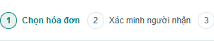
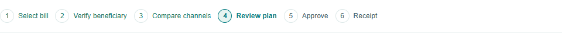
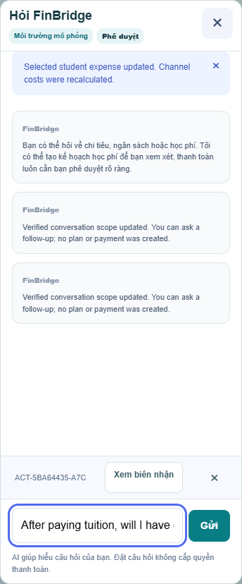

# Xác minh luồng hóa đơn và shortcut chat

Ngày: 09/10/2026. Bản nền: `0682ca8`; các thay đổi trong commit chứa báo cáo này.

## Hành vi đã sửa

- Shortcut trong chat lấy kế hoạch từ ngữ cảnh đã xác minh của phiên chat, không lấy kế hoạch mới nhất của workspace. Hỏi về hóa đơn B không ghim biên nhận của A.
- Nút × ẩn shortcut, không hủy kế hoạch hoặc thay đổi biên nhận. Trạng thái ẩn được giữ trong tab qua đóng/mở chat và tải lại trang; các liên kết trong câu trả lời cũ vẫn còn.
- Bấm lại hóa đơn đang chọn để bỏ chọn, kể cả chỉ có một hóa đơn hoặc hóa đơn đã thanh toán. Không tự chọn hóa đơn khác khi bỏ chọn; thao tác không vô hiệu draft đã khóa.
- Lưu hóa đơn qua giao diện trả về bước 1, không tự chọn hóa đơn vừa lưu. Không thay corridor hoặc làm mới quote của draft cũ chỉ vì thêm hóa đơn.
- Request bỏ chọn cũ không bỏ chọn hóa đơn khác do phiên khác vừa chọn; giao diện báo lựa chọn hiện tại được giữ nguyên.
- Nút xác nhận kênh và tạo kế hoạch khóa đúng bill/version/account/channel/quote vào draft. Đây không phải phê duyệt thanh toán.
- Hóa đơn có draft được mở lại qua liên kết đúng draft, độc lập với plan/receipt đang ghim trong URL.

## Tiến trình và quy tắc

| Bước | Điều kiện hiển thị |
| --- | --- |
| 1. Chọn hóa đơn | Chưa chọn hóa đơn, kể cả sau khi lưu hóa đơn mới. |
| 2. Xác minh người nhận | Người nhận chưa khớp. Quy tắc chọn hóa đơn hợp lệ hiện có vẫn được giữ. |
| 3. So sánh kênh | Đã chọn hóa đơn đã xác minh, chưa có draft hợp lệ. Bước 2 tự hoàn tất theo kết quả registry, không yêu cầu một lần phê duyệt giả. |
| 4. Kiểm tra kế hoạch | Có draft chờ duyệt của đúng hóa đơn; plan hủy/vô hiệu không nâng tiến trình. |
| 5. Phê duyệt | Đang mở hộp xác nhận đúng plan, hoặc backend ghi nhận APPROVED. Đóng hộp mà chưa duyệt trở về bước 4. |
| 6. Biên nhận | Có biên nhận Sandbox thực sự của đúng hóa đơn. Không suy ra thanh toán từ URL hoặc hóa đơn khác. |

Chỉ một bước có `aria-current="step"`. Trên màn hình hẹp, thanh tiến trình cuộn ngang để hiện bước hiện tại, không cuộn trang lên đầu. Việc chọn/bỏ chọn vẫn cập nhật qua AJAX và giữ thứ tự hóa đơn.

Các phép tính tiền, schema, provider AI, Policy Guard, hạn mức, approval, idempotency và Sandbox executor không thay đổi.

## Lệnh đã chạy và kết quả thực tế

Maven sử dụng: `C:\Users\ADMIN\Downloads\apache-maven-3.9.16-bin\apache-maven-3.9.16\bin\mvn.cmd`.
Các lệnh dưới dùng chính executable đó. Chỉ chạy test liên quan, không chạy full suite.

```powershell
mvn -Dtest=StudentExpenseIntegrationTest,StudentExpensePlaywrightE2ETest,AssistantPanelPlaywrightTest test
```

- Lượt đầu: 33 test, 32 đạt, 1 fail. Assertion của test mới so sánh cả selection/corridor/quote dù chính test thay lựa chọn hóa đơn. Đã sửa assertion để kiểm tra mọi bảng còn lại bất biến, gồm tiền, giao dịch, approval, snapshot và receipt; không nới guard.
- Lượt sau khi sửa và tách việc lưu bill khỏi refresh quote: **34/34 PASS**, 0 skipped.
- Log lượt đạt: `bill-workflow/bill-workflow-final.log`.

```powershell
mvn "-Dtest=AssistantPanelPlaywrightTest#billHelpCannotPinAnotherBillsReceiptAndShortcutCanBeDismissedAcrossReopening,StudentExpensePlaywrightE2ETest#soleBillCanBeDeselectedAndReselectedWithoutPaymentOnDesktopAndMobile,SessionConversationIntegrationTest,GlobalAssistantIntegrationTest,PaymentWorkflowPlaywrightE2ETest" test
```

- **57/57 PASS**, 0 skipped. Bao gồm ngữ cảnh tách phiên, truy vấn chỉ đọc, draft đối tượng cụ thể, approval và receipt.
- Log: `bill-workflow/bill-workflow-regression.log`.

```powershell
mvn "-Dtest=StudentExpenseIntegrationTest,StudentExpensePlaywrightE2ETest#selectedBillResumesItsOwnDraftInsteadOfTheReceiptPinnedByThePageUrl+soleBillCanBeDeselectedAndReselectedWithoutPaymentOnDesktopAndMobile+inPlaceFormsKeepApprovalAndSandboxExecutionControlledAndEmergencyStopBlocksNewActions" test
```

- **15/15 PASS**, 0 skipped, trên bản cuối sau bổ sung tiếp tục draft và thông báo stale selection.
- Log: `bill-workflow/bill-workflow-binding.log`.

Các đợt có test chạy lặp; không cộng các tổng trên thành số test riêng biệt.

Log thô được giữ local trong `docs/bill-workflow/*.log` ngoài `target/`; repository bỏ qua file `.log`. Báo cáo kết quả này và các ảnh PNG được lưu cùng Git để team xem lại.

## Browser automation và bằng chứng

- Chrome headless qua Playwright, ứng dụng Spring Boot thật tại cổng local 8096/8101/8095, database H2 in-memory riêng cho từng test class.
- Kiểm chứng desktop 1440px, mobile mô phỏng 390px và 360px, nhãn Anh–Việt. Có ảnh trong `bill-workflow/`.
- Bỏ chọn duy nhất → tải lại vẫn bước 1 → chọn lại bước 3; thêm hóa đơn thứ hai qua form → bước 1 → chọn rõ hóa đơn → bước 3.
- Tạo draft → AWAITING_APPROVAL, không có receipt → mở xác nhận bước 5 → hủy về bước 4, không POST approval → duyệt → đúng một receipt, bước 6.
- Biên nhận A trong URL + chọn B → tiến trình và liên kết tiếp tục dùng B. View receipt của A không xuất hiện khi hỏi về B.
- Đóng shortcut ở màn hình hẹp, đóng/mở chat và reload vẫn ẩn. Đổi sang hỏi ngân sách không ghim biên nhận cũ.
- Lưu bill USD mới không thay quote của draft CNY cũ; approval riêng vẫn thực thi đúng CNY/bill cũ. Không thực thi bill mới.
- Test browser hiện có cũng kiểm tra Emergency Stop không tạo thêm receipt, và không tải lại document khi tạo/duyệt.

Ảnh tiêu biểu:







## Giới hạn xác minh

- Đây là browser automation, không phải kiểm tra thủ công hay kiểm tra điện thoại thật.
- Model được mock ở test chat; không gọi Gemini thật trong đợt này. Không thay provider/schema/routing AI.
- Không thao tác reset, thanh toán hoặc Emergency Stop trên Render. Chưa nghiệm thu bản deploy mới.
- Đây vẫn là dữ liệu và recipient registry mô phỏng; thay đổi workflow không tạo ra kết nối ngân hàng hoặc xác minh trường thật.

## Kiểm tra ngắn sau deploy

1. Xác nhận commit chứa thay đổi đang Live; reload trang để nhận asset mới.
2. Chọn rồi bấm lại một hóa đơn: phải bỏ chọn, bước 1; chọn lại hóa đơn đã xác minh: bước 3.
3. Thêm hóa đơn: bước 1, không tự chọn. Chọn rõ hóa đơn và kênh; tạo draft rồi kiểm tra bill/account/channel trên màn hình xem lại.
4. Trong chat hỏi về hóa đơn khác với receipt đang xem: không ghim receipt cũ. Bấm × trên shortcut: ẩn được và không hủy payment.
5. Trên điện thoại thật: mở chat/bàn phím, đóng shortcut, cuộn thanh tiến trình và kiểm tra nút gửi không bị che.

Nếu thử approval/reset trên Render dùng chung, phối hợp team trước. Không cần gọi model để kiểm tra thao tác chọn/bỏ chọn và tiến trình UI.
